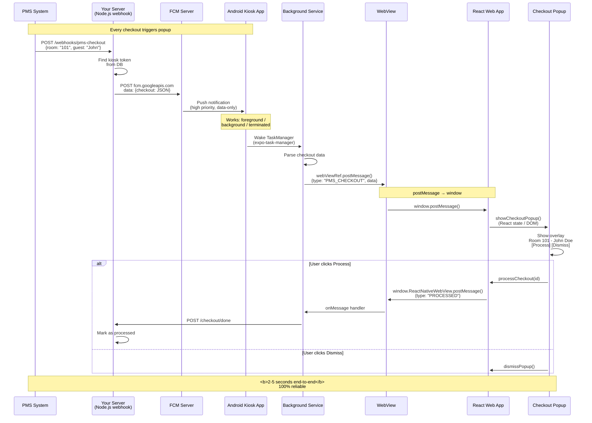

```mermaid
sequenceDiagram
    participant PMS as PMS System
    participant Webhook as Your Server<br/>(Node.js webhook)
    participant FCM as FCM Server
    participant Kiosk as Android Kiosk App
    participant Service as Background Service
    participant WebView as WebView
    participant ReactApp as React Web App
    participant Popup as Checkout Popup

    Note over PMS,Kiosk: Every checkout triggers popup

    PMS->>+Webhook: POST /webhooks/pms-checkout<br/>{room: "101", guest: "John"}
    Webhook->>Webhook: Find kiosk token<br/>from DB
    Webhook->>+FCM: POST fcm.googleapis.com<br/>data: {checkout: JSON}
    FCM->>+Kiosk: Push notification<br/>(high priority, data-only)

    Note over Kiosk: Works: foreground /<br/>background / terminated

    Kiosk->>+Service: Wake TaskManager<br/>(expo-task-manager)
    Service->>Service: Parse checkout data
    Service->>+WebView: webViewRef.postMessage()<br/>{type: "PMS_CHECKOUT", data}

    Note over WebView,ReactApp: postMessage → window

    WebView->>+ReactApp: window.postMessage()
    ReactApp->>+Popup: showCheckoutPopup()<br/>(React state / DOM)
    Popup->>Popup: Show overlay<br/>Room 101 - John Doe<br/>[Process] [Dismiss]

    alt User clicks Process
        Popup->>ReactApp: processCheckout(id)
        ReactApp->>+WebView: window.ReactNativeWebView.postMessage()<br/>{type: "PROCESSED"}
        WebView->>+Service: onMessage handler
        Service->>+Webhook: POST /checkout/done
        Webhook->>Webhook: Mark as processed
    else User clicks Dismiss
        Popup->>ReactApp: dismissPopup()
    end

    Note over PMS,Popup: <b>2-5 seconds end-to-end</b><br/>100% reliable
```
